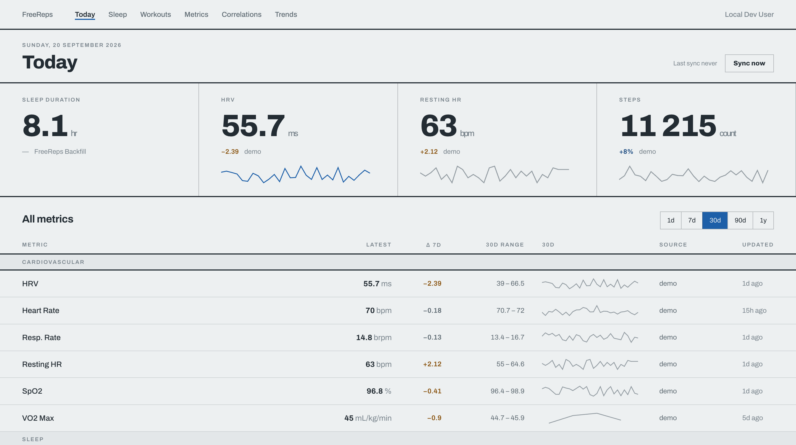
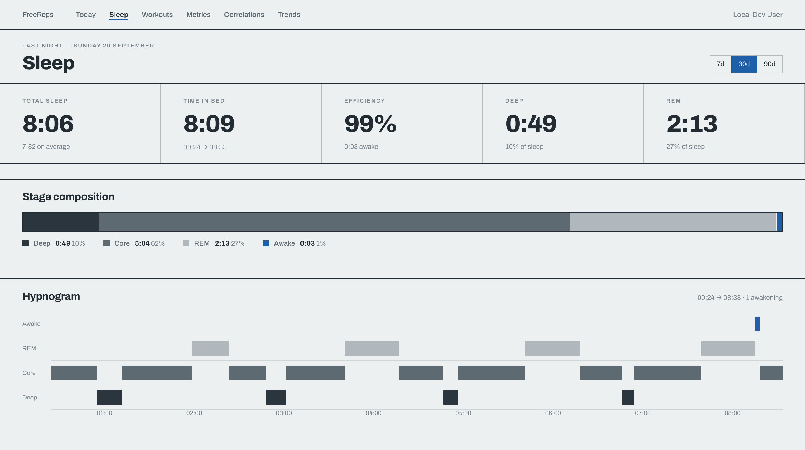
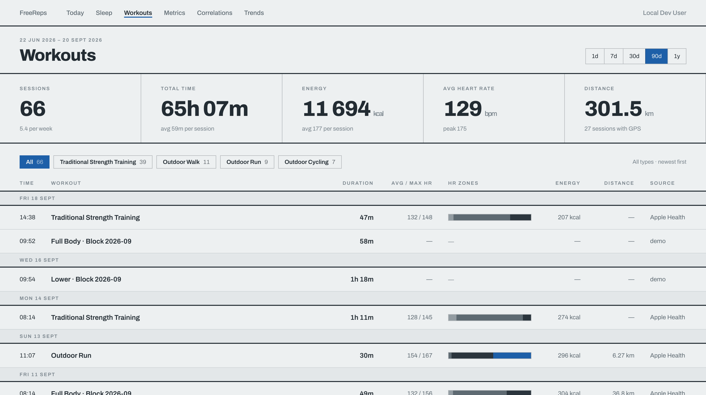
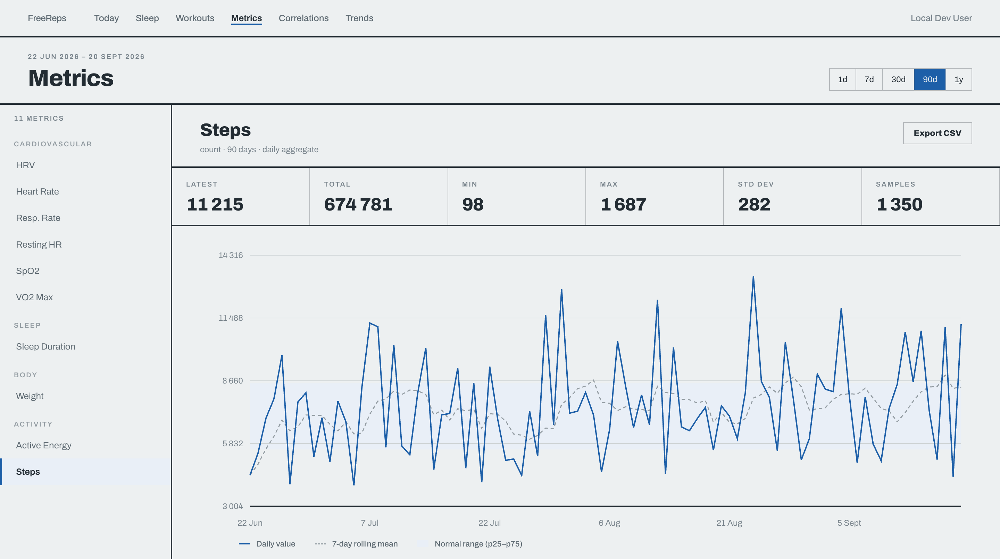
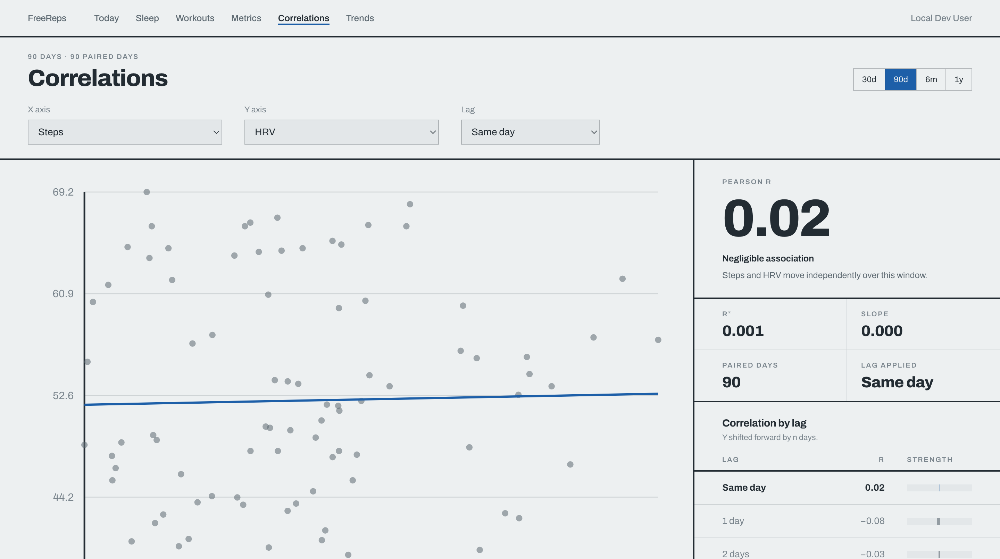
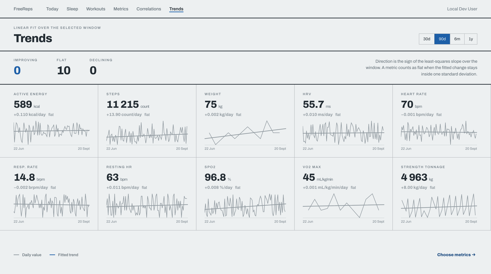

# FreeReps

**F**reely hosted **Re**cords, **E**valuation & **P**rocessing **S**erver

A self-hosted server that receives health data from Apple Watch and Oura Ring, stores it persistently, visualizes it through a web dashboard with freely configurable correlations, and exposes it as an MCP server for LLMs. The iOS companion app syncs HealthKit data directly to your server, and the built-in Oura integration pulls data via the Oura API.

[](https://apps.apple.com/us/app/freereps/id6760661354)

## Acknowledgements

The FreeReps iOS companion app is based on [HealthBeat](https://github.com/kempu/HealthBeat) by kempu, an open-source iOS app for syncing Apple Health data. HealthBeat was adapted into the FreeReps companion app for the self-hosted FreeReps server. Licensed under the MIT License.

## Screenshots

| Dashboard | Sleep |
|:-:|:-:|
|  |  |

| Workouts | Metrics |
|:-:|:-:|
|  |  |

| Correlations | Trends |
|:-:|:-:|
|  |  |

| MCP |
|:-:|
|  |

| iOS App | | | |
|:-:|:-:|:-:|:-:|
|  |  |  |  |

## Why FreeReps?

Apple Health collects extensive data but offers no way to relate metrics to each other, no API for external analysis, and no export into a queryable system you own.

Other apps compute scores but are closed-source, subscription-based, and opaque. FreeReps takes the opposite approach: **raw data + flexible visualization + LLM for interpretation**.

## Architecture

```
┌──────────────┐     HealthKit       ┌─────────────────────────────────────────┐
│ FreeReps     │ ────────────────→   │              FreeReps Server            │
│ iOS App      │    HTTP POST        │                                         │
└──────────────┘                     │  ┌──────────┐  ┌─────────────────┐     │
                                     │  │ Ingest   │→ │  Storage (DB)   │     │
┌──────────────┐     OAuth2 + Poll   │  │ API      │  │  Time Series    │     │
│  Oura Ring   │ ←───────────────    │  └──────────┘  └────────┬────────┘     │
│  (API v2)    │                     │  ┌──────────┐           │              │
└──────────────┘                     │  │ Oura     │→──────────┘              │
                                     │  │ Sync     │  (source-priority dedup) │
                                     │  └──────────┘                          │
                                     │              ┌──────────┬──────────┐   │
                                     │              ▼                     ▼   │
                                     │  ┌────────────────┐  ┌─────────────┐  │
                                     │  │ Web Dashboard  │  │ MCP Server  │  │
                                     │  │ Correlations   │  │ stdio / SSE │  │
                                     │  │ Trends, Charts │  └──────┬──────┘  │
                                     │  └────────────────┘         │         │
                                     └─────────────────────────────┼─────────┘
                                                                   ▼
                                                          Claude (via MCP)
                                                          = the actual
                                                            "AI coach"
```

## Tech Stack

| Component | Technology |
|-----------|------------|
| Backend | Go (single binary with embedded frontend) |
| Frontend | React 19 + Vite + Tailwind CSS 4 |
| Charts | uPlot (time-series) + Recharts (bar/scatter) |
| Database | PostgreSQL + TimescaleDB |
| Auth & Networking | [Tailscale](https://tailscale.com/) (tsnet) — zero-config TLS + identity |
| iOS App | Swift (HealthKit, BackgroundTasks, ActivityKit) |
| Config | YAML |
| Deployment | Docker Compose |

## iOS Companion App

The FreeReps companion app syncs Apple HealthKit data directly to the server over HTTP. No intermediate cloud services, no third-party dependencies — just HealthKit to your server.

### What it syncs

- **85+ quantity types** — steps, heart rate, blood pressure, blood glucose, body temperature, VO2 max, nutrition, audio exposure, and more
- **22 category types** — sleep analysis, menstrual cycles, symptoms, mindfulness, heart events, stand hours
- **Workouts** — activity type, duration, energy burned, distance, swim strokes, flights climbed
- **Blood pressure** — systolic/diastolic correlation pairs
- **ECG recordings** — classification, heart rate, voltage measurements
- **Audiograms** — hearing sensitivity by frequency
- **Workout routes** — GPS coordinates recorded during workouts
- **Activity summaries** — daily ring data (active energy, exercise minutes, stand hours)

### Features

- **Full and incremental sync** — initial backfill of all historical data, then ongoing incremental syncs
- **Real-time background sync** — HealthKit observer queries for immediate delivery when new data is recorded
- **Background processing** — periodic sync via BGProcessingTask when the app isn't active
- **Live Activity** — sync progress on the lock screen and Dynamic Island
- **CSV import** — import Alpha Progression CSV files via share sheet or file picker
- **No dependencies** — pure Swift using only Apple frameworks

### Requirements

- iOS 16.2+
- Physical device (HealthKit is not available in the Simulator)
- A running FreeReps server accessible from the device's network

## Prerequisites

- **[Tailscale](https://tailscale.com/)** — FreeReps uses Tailscale for authentication and TLS natively (via [tsnet](https://tailscale.com/kb/1244/tsnet)). There are no passwords or API keys — access is controlled by your tailnet. Tailscale must be set up before running FreeReps.
- **[Health Auto Export](https://apps.apple.com/app/health-auto-export-json-csv/id1115567069)** (iOS, optional) — An alternative way to get Apple Health data into FreeReps via `.hae` file exports uploaded with `freereps-upload`. Not needed if using the FreeReps companion app.
- **[mcp-proxy](https://github.com/sparfenyuk/mcp-proxy)** (optional) — Required for connecting Claude Desktop to a remote FreeReps instance. Bridges stdio↔SSE transports. Install with `brew install mcp-proxy` or `pip install mcp-proxy`.

## Quick Start

### Server (Docker Compose)

```bash
git clone https://github.com/meltforce/FreeReps.git
cd FreeReps/server
cp config.example.yaml config.yaml
# Edit config.yaml — set database password, enable Tailscale
docker compose up -d
```

To use the pre-built image from Docker Hub instead of building locally, replace the `app` service's `build: .` with `image: meltforce/freereps:latest` in `docker-compose.yml`.

### Test Server (Demo Mode)

Run a FreeReps server with demo data (e.g., for App Store review or sync testing):

#### Using Docker (recommended)

```bash
cd FreeReps/server
cp config.example.yaml config.yaml
# Set tailscale.enabled: false in config.yaml for local dev

docker compose up -d db
docker compose run --rm -e FREEREPS_DEMO=true app
```

#### From source

```bash
cd FreeReps/server
cp config.example.yaml config.yaml
# Set tailscale.enabled: false in config.yaml for local dev

docker compose up -d db
cd web && npm ci && npm run build && cd ..
go run ./cmd/freereps -config config.yaml -demo
```

This seeds the database with 90 days of realistic health data including heart rate, sleep, workouts, and activity rings. The data is deterministic and idempotent — restarting with `-demo` or `FREEREPS_DEMO=true` won't create duplicates.

The server will be available at `http://localhost:8080`. To tear down:

```bash
docker compose down -v
```

### iOS App

1. Open `app/FreeReps.xcodeproj` in Xcode
2. Set your development team and bundle identifier in **Signing & Capabilities**
3. Build and run on a physical device
4. In Settings, enter your FreeReps server URL
5. Grant HealthKit permissions and start syncing

### Upload Tool (macOS)

`freereps-upload` is a client-side CLI tool that reads `.hae` files from your iCloud Drive (exported by [Health Auto Export](https://healthyapps.dev)), converts them to REST API format, and uploads them to your FreeReps server over Tailscale.

**Install:**

```bash
curl -sSL https://raw.githubusercontent.com/meltforce/FreeReps/main/server/scripts/install-upload.sh | bash
```

**Usage:**

```bash
# First run — upload all historical data
freereps-upload \
  -server https://freereps.your-tailnet.ts.net \
  -path ~/Library/Mobile\ Documents/com~apple~CloudDocs/Health\ Auto\ Export/AutoSync

# Subsequent runs — only new/changed files are uploaded (resumable)
freereps-upload \
  -server https://freereps.your-tailnet.ts.net \
  -path ~/Library/Mobile\ Documents/com~apple~CloudDocs/Health\ Auto\ Export/AutoSync
```

**Flags:**

| Flag | Default | Description |
|------|---------|-------------|
| `-server` | (required) | FreeReps server URL |
| `-path` | (required) | Path to AutoSync directory (or parent) |
| `-dry-run` | false | Parse and convert without sending |
| `-batch-size` | 2000 | Data points per metric payload |
| `-version` | | Print version and exit |

**Requirements:** `lzfse` must be installed (`brew install lzfse`).

**Update / Uninstall:**

```bash
# Update to latest version
curl -sSL https://raw.githubusercontent.com/meltforce/FreeReps/main/server/scripts/install-upload.sh | bash -s -- --update

# Uninstall
curl -sSL https://raw.githubusercontent.com/meltforce/FreeReps/main/server/scripts/install-upload.sh | bash -s -- --uninstall
```

**State tracking:** Upload progress is tracked in `~/.freereps-upload/state.db` (SQLite). Files are identified by path + size + SHA-256 hash, so changed files are re-uploaded and the tool is fully resumable.

## Data Sources

### FreeReps iOS App (recommended)

The companion app syncs HealthKit data directly to the server via HTTP POST. Supports full historical backfill and real-time incremental sync.

### Oura Ring

FreeReps integrates directly with the Oura API v2 to pull ring data. Syncs every 30 minutes with 90-day initial backfill.

**Data synced:**
- **Oura-exclusive** — readiness score, sleep score, activity score, temperature deviation, stress, recovery, resilience, cardiovascular age
- **Overlapping with Apple Watch** — heart rate, HRV, SpO2, respiratory rate, steps, active calories, workouts, sleep sessions/stages

**Source priority dedup:** When both Oura and Apple Watch report the same metric, FreeReps deduplicates at query time using configurable source priority (Settings > Source Priority). Only the highest-priority source's data is shown — no double-counting.

#### Oura Setup

1. **Register an Oura API app** at [cloud.ouraring.com/oauth/applications](https://cloud.ouraring.com/oauth/applications):
   - Redirect URI: the exact value shown under Settings > Oura Ring. FreeReps
     derives it from the address you reach it on, so it needs no configuration —
     see [Redirect URIs](#redirect-uris) if you need to pin it.
   - Privacy Policy URL: your FreeReps website's privacy page
   - Terms of Service URL: your FreeReps website's terms page
   - Enable all scopes

2. **Enter credentials in FreeReps**: Go to Settings > Oura Ring, enter your Client ID and Client Secret, click "Save Credentials"

3. **Authorize**: Click "Authorize with Oura", approve access on Oura's page. You'll be redirected back to FreeReps.

4. **Sync starts automatically** every 30 minutes. Use "Sync Now" for immediate sync. Check Settings > Import Logs for sync status.

### Withings

FreeReps reads weight, body composition and blood pressure directly from the
Withings Public API. Syncs every 30 minutes with 90-day initial backfill.

**Data synced:** weight, fat ratio, fat mass, fat free mass, muscle mass, bone
mass, body water, blood pressure (systolic/diastolic) and the pulse the cuff
records with each reading.

The same measurements also reach FreeReps through Apple Health, where they
arrive only once the Health app has synced. The default source priority puts
Withings first, so the direct read wins wherever both cover a day. The Apple
Health path is not disabled — it remains the only route for an installation
without a Withings account.

#### Withings Setup

1. **Register an app** in the [Withings Partner Hub](https://developer.withings.com/dashboard/).
   The Public API tier requires no contract and no approval.
   - Redirect URI: the exact value shown under Settings > Withings. It follows
     the address you reach FreeReps on, so renaming a host changes it — and the
     OAuth callback is the only place that breaks, because token refresh sends no
     redirect URI. See [Redirect URIs](#redirect-uris).
   - Scope: `user.metrics`

2. **Enter credentials in FreeReps**: Settings > Withings, enter Client ID and
   Client Secret, click "Save credentials".

3. **Authorize**: Click "Authorize with Withings" and approve access. The
   authorization code is valid for 30 seconds, so complete the redirect rather
   than leaving the consent page open.

4. **Sync starts automatically** every 30 minutes. Use "Sync now" for an
   immediate run; Settings > Import Logs carries the outcome.

### Redirect URIs

Both OAuth integrations need a redirect URI registered with the provider, and it
has to match what FreeReps sends — the provider compares the value from the start
of the flow with the one sent when the code is exchanged.

**FreeReps derives it per request** from the origin you reached it on:
`https://<host>/oura/callback` and `https://<host>/withings/callback`. A reverse
proxy's `X-Forwarded-Proto` and `X-Forwarded-Host` are honoured. The current value
is shown in the Settings tab of each integration, which is the value to paste into
the provider's form.

**Pin it** where the derived value is not stable or not the registered one — the
UI answering on several names, or a proxy under a name the headers do not carry:

```yaml
server:
  base_url: "https://freereps.example.ts.net"   # scheme and host only
```

`FREEREPS_SERVER_BASE_URL` overrides the same value. A path in it is refused at
startup rather than producing a URI the provider rejects at the end of a flow.

### Health Auto Export (iOS, legacy)

The iOS app [Health Auto Export](https://healthyapps.dev) can export Apple Health data as `.hae` files to iCloud Drive, which can then be uploaded to FreeReps using the `freereps-upload` CLI tool.

### Alpha Progression (iOS)

[Alpha Progression](https://alphaprogression.com) CSV exports provide detailed strength training data (exercises, sets, reps, weight, RIR).

Upload via the dashboard, the iOS companion app (share sheet / file picker), or POST to `/api/v1/ingest/alpha`.

## Dashboard Features

- **Daily Overview** — Key metrics at a glance (sleep, HRV, RHR, activity)
- **Correlation Explorer** — Plot any metric against any other (scatter + overlay, Pearson r)
- **Sleep View** — Hypnogram, stages, HR/HRV/SpO2 during sleep
- **Workout View** — HR zones, route map, Alpha Progression sets
- **Metrics Deep Dive** — Time-series with moving average, normal range band
- **Saved Views** — Store correlation configurations for quick recall

## Alerts

An integration that stops delivering is the failure this project could not see:
the container is healthy, the dashboard answers, and a source simply writes no
more rows. FreeReps therefore reports that state itself, as a JSON POST to an
[ntfy](https://ntfy.sh) topic — or to any endpoint that accepts one.

The conditions are evaluated from `import_logs` rather than from inside the sync
loops, so a syncer that stopped running is covered as well:

| `monitor_id` | Condition |
|---|---|
| 9200 | the manual test from Settings → Alerts |
| 9201 | the Withings sync failed the configured number of times in a row |
| 9202 | the Oura sync failed the configured number of times in a row |
| 9203 | the Hevy sync failed the configured number of times in a row |
| 9204 | no Health Auto Export delivery for longer than the silence threshold |

The payload follows Uptime Kuma's webhook shape, so an existing Kuma consumer
needs no second parser:

```json
{
  "schema": 1,
  "monitor_id": 9201,
  "service": "freereps - withings sync",
  "status": 0,
  "hostname": "freereps",
  "monitor_type": "freereps",
  "since": "2026-09-20T11:18:08Z",
  "msg": "3 consecutive failed runs — user 2 since 2026-09-20T09:41:56Z: …"
}
```

`status` is `0` for a problem and `1` for its resolution. Four rules shape what
arrives:

- **One message per transition.** The state per condition is stored
  (`alert_state`), so a problem is reported when it starts and again when it
  clears — not on every check cycle.
- **A resolution always follows.** A condition that only ever sent `0` would
  leave a stale alert in whatever reads the topic.
- **A threshold sits in front of the channel.** The default is three consecutive
  failed runs of one source for one user, which at a 30-minute sync interval
  reports a real defect within two hours while a single DNS timeout stays out.
- **The state is written after the send succeeded.** An unreachable topic delays
  an alert; it does not swallow it.

Failures are counted per user, because a second user whose sync works would
otherwise mask a first user whose sync does not.

### Configuring it

Settings → **Alerts**: the topic URL, the name to report as, the check interval,
the failure threshold, the silence threshold, and a button that posts a test
message on 9200 with `status: 1`. The values live in the database; the `alerts`
block in `config.yaml` seeds them on first start only, so a redeploy cannot
overwrite what was entered in the UI.

```yaml
alerts:
  enabled: false
  ntfy_url: "https://ntfy.example.com/freereps-alerts"
  hostname: "freereps"
  check_interval: "5m"
  failure_threshold: 3
  apple_silence: "36h"   # 0 turns the Health Auto Export rule off
```

Reading the topic back is the quickest way to tell "FreeReps did not send" from
"the subscriber did not receive":

```bash
curl -s "https://ntfy.example.com/freereps-alerts/json?poll=1&since=10m"
```

## MCP Server

FreeReps exposes health data to Claude (and other LLMs) via the Model Context Protocol.


**Tools:** `get_health_metrics`, `get_workouts`, `get_sleep_data`, `get_metric_stats`, `get_correlation`, `compare_periods`, `list_available_metrics`, `get_workout_sets`

**Resources:** `daily_summary`, `recent_workouts`, `metric_catalog`

### stdio (Claude Code)

```bash
freereps --mcp -config config.yaml
```

Add to your Claude Code MCP config:

```json
{
  "mcpServers": {
    "freereps": {
      "command": "/path/to/freereps",
      "args": ["--mcp", "-config", "/path/to/config.yaml"]
    }
  }
}
```

### SSE (Remote via mcp-proxy)

The MCP SSE endpoint is available at `/mcp/sse` when the server is running. To connect Claude Desktop (or other stdio-only clients) to a remote FreeReps instance, use [mcp-proxy](https://github.com/sparfenyuk/mcp-proxy) to bridge stdio↔SSE:

```bash
brew install mcp-proxy   # or: pip install mcp-proxy
```

Add to your Claude Desktop config (`~/Library/Application Support/Claude/claude_desktop_config.json`):

```json
{
  "mcpServers": {
    "freereps": {
      "command": "mcp-proxy",
      "args": ["https://freereps.your-tailnet.ts.net/mcp/sse"]
    }
  }
}
```

No local FreeReps binary needed — `mcp-proxy` handles the transport bridging, and Tailscale handles authentication.

## Supported Metrics

| Category | Metrics |
|----------|---------|
| Cardiovascular | heart_rate, resting_heart_rate, heart_rate_variability, blood_oxygen_saturation, respiratory_rate, vo2_max, blood_pressure_systolic, blood_pressure_diastolic, blood_pressure_heart_rate |
| Sleep | sleep_analysis, apple_sleeping_wrist_temperature |
| Body | weight_body_mass, body_fat_percentage, fat_mass, lean_body_mass, muscle_mass, bone_mass, body_water |
| Activity | active_energy, basal_energy_burned, step_count, flights_climbed, apple_exercise_time |
| Oura | readiness_score, sleep_score, activity_score, temperature_deviation, stress, recovery, resilience, cardiovascular_age |
| Workouts | All types (with HR data + routes, deduped across sources) |

## Design Principles

- **Privacy first** — All data stays local. No cloud uploads, no telemetry.
- **Self-hosted** — Runs on your own server/homelab.
- **Data over scores** — Raw data + visualization + LLM instead of proprietary algorithms.
- **Flexible over opinionated** — Correlation explorer instead of hard-wired dashboards.
- **Single binary** — Go binary with embedded web UI.

## API Reference

| Endpoint | Method | Description |
|----------|--------|-------------|
| `/api/v1/ingest/` | POST | Ingest health data JSON |
| `/api/v1/ingest/alpha` | POST | Ingest Alpha Progression CSV |
| `/api/v1/ingest/import` | POST | Unified import (auto-detects format) |
| `/api/v1/metrics/latest` | GET | Latest value per metric |
| `/api/v1/metrics` | GET | Time-range metric query |
| `/api/v1/metrics/stats` | GET | Metric statistics (avg, min, max, stddev) |
| `/api/v1/timeseries` | GET | Time-bucketed metric data |
| `/api/v1/correlation` | GET | Pearson r between two metrics |
| `/api/v1/sleep` | GET | Sleep sessions + stages |
| `/api/v1/workouts` | GET | Workout list with filters |
| `/api/v1/workouts/{id}` | GET | Workout detail |
| `/api/v1/workouts/{id}/sets` | GET | Alpha Progression sets |
| `/api/v1/allowlist` | GET | Metric allowlist |
| `/api/v1/metrics/available` | GET | Available metrics with display metadata |
| `/api/v1/metrics/visibility` | PUT | Save per-user metric visibility |
| `/api/v1/source-priority` | GET/PUT | Source priority configuration |
| `/api/v1/oura/status` | GET | Oura connection status |
| `/api/v1/oura/credentials` | PUT | Save Oura OAuth2 credentials |
| `/api/v1/oura/authorize` | POST | Start Oura OAuth2 flow |
| `/api/v1/oura/sync` | POST | Trigger manual Oura sync |
| `/api/v1/oura/disconnect` | DELETE | Remove Oura connection |
| `/api/v1/withings/status` | GET | Withings connection status |
| `/api/v1/withings/credentials` | PUT | Save Withings OAuth2 credentials |
| `/api/v1/withings/authorize` | POST | Start Withings OAuth2 flow |
| `/api/v1/withings/sync` | POST | Trigger manual Withings sync |
| `/api/v1/withings/disconnect` | DELETE | Remove Withings connection |
| `/api/v1/alerts` | GET | Alert channel configuration and per-condition state |
| `/api/v1/alerts` | PUT | Save the alert channel configuration |
| `/api/v1/alerts/test` | POST | Post a test message on `monitor_id` 9200 |
| `/api/v1/me` | GET | Current user identity |

## Documents

| File | Holds |
|---|---|
| [`CLAUDE.md`](CLAUDE.md) | Conventions and gotchas for working in this repo. |
| [`ROADMAP.md`](ROADMAP.md) | Open work. |
| [`DECISIONS.md`](DECISIONS.md) | Decisions taken, with reasoning. |
| [`INCIDENTS.md`](INCIDENTS.md) | Postmortems. |
| [`server/specs/`](server/specs/) | Wire formats and payload shapes of the ingest sources. |

## License

[MIT](LICENSE)
